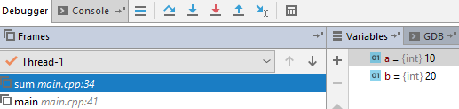

## Alokacja na stosie

<div class="multicolumn">
<div class="col">

* <!-- .element: class="fragment fade-in" --> Stos wywołań składa się z ramek stosu (1 funkcja = 1 ramka)
* <!-- .element: class="fragment fade-in" --> Dokładną zawartość ramki stosu określa ABI, ale zazwyczaj składa się ona z:
  * <!-- .element: class="fragment fade-in" --> argumentów przekazanych do funkcji
  * <!-- .element: class="fragment fade-in" --> adresu powrotu do miejsca w funkcji wywołującej
  * <!-- .element: class="fragment fade-in" --> miejsca na zmienne lokalne
* <!-- .element: class="fragment fade-in" --> Zachodzi automatyczna dealokacja ramki, gdy wychodzimy poza zakres


<!-- .element: class="fragment fade-in" -->

</div>
<div class="col">

```cpp
#include <iostream>

int sum(int a, int b)
{
    return a + b;
}

int main()
{
    int a = 10;
    int b = 20;

    std::cout << sum(a, b);

    return 0;
}


```

</div>
</div>
