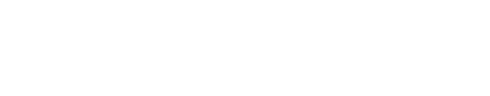

<!-- .slide: data-background="#111111" -->

# `std::unique_ptr<>`

___

## `std::unique_ptr<>`

### Cechy

* <!-- .element: class="fragment fade-in" --> jeden obiekt ma dokładnie jednego właściciela
* <!-- .element: class="fragment fade-in" --> destruktor niszczy wskazywany obiekt i zwalnia pamięć
* <!-- .element: class="fragment fade-in" --> kopiowanie jest niedozwolone
* <!-- .element: class="fragment fade-in" --> możliwe jest tylko przenoszenie
* <!-- .element: class="fragment fade-in" --> można przekazać własny <code>deleter</code> (funkcję do zawołania w destruktorze)



___

### `std::unique_ptr<>` użycie

* stare podejście vs nowe podejście

<div class="multicolumn">
<div class="col">

```cpp
#include <iostream> // old-style approach


struct Msg {
    int getValue() { return 42; }
};

Msg* createMsg() {
    return new Msg{};
}

int main() {
    auto msg = createMsg();

    std::cout << msg->getValue();
    delete msg;
}
```
<!-- .element: class="fragment fade-in" -->

</div>

<div class="col">

```cpp
#include <memory> // modern approach
#include <iostream>

struct Msg {
    int getValue() { return 42; }
};

std::unique_ptr<Msg> createMsg() {
    return std::make_unique<Msg>();
}

int main() {
    // unique ownership
    auto msg = createMsg();

    std::cout << msg->getValue();
}

```
<!-- .element: class="fragment fade-in" -->

</div>

___

### `std::unique_ptr<>` użycie

* <!-- .element: class="fragment fade-in" --> Kopiowanie niedozwolone
* <!-- .element: class="fragment fade-in" --> Przenoszenie dozwolone

<div class="multicolumn">
<div class="col">

```cpp
std::unique_ptr<MyData> source(void);
void sink(std::unique_ptr<MyData> ptr);

void simpleUsage() {
    source();
    sink(source());
    auto ptr = source();
    // sink(ptr);       // compilation error
    sink(std::move(ptr));
    auto p1 = source();
    // auto p2 = p1;    // compilation error
    auto p2 = std::move(p1);
    // p1 = p2;         // compilation error
    p1 = std::move(p2);
}
```
<!-- .element: class="fragment fade-in" -->

</div>

<div class="col">

```cpp
std::unique_ptr<MyData> source(void);
void sink(std::unique_ptr<MyData> ptr);

void collections() {
    std::vector<std::unique_ptr<MyData>> v;
    v.push_back(source());

    auto tmp = source();
    // v.push_back(tmp); // compilation error
    v.push_back(std::move(tmp));

    // sink(v[0]);       // compilation error
    sink(std::move(v[0]));

}
```
<!-- .element: class="fragment fade-in" -->

</div>

___

#### `std::unique_ptr<>` kooperacja ze zwykłymi wskaźnikami

```cpp
#include <memory>

void legacyInterface(int*) {}
void deleteResource(int* p) { delete p; }
void referenceInterface(int&) {}

int main() {
    auto ptr = std::make_unique<int>(5);
    legacyInterface(ptr.get());
    deleteResource(ptr.release());
    ptr.reset(new int{10});
    referenceInterface(*ptr);
    ptr.reset(); // ptr is a nullptr
    return 0;
}
```

* <!-- .element: class="fragment fade-in" --> <code>T* get()</code> – zwraca zwykły wskaźnik bez zwalniania własności
* <!-- .element: class="fragment fade-in" --> <code>T* release()</code> – zwraca zwykły wskaźnik i zwalnia własność
* <!-- .element: class="fragment fade-in" --> <code>void reset(T*)</code> – podmienia wskazywany obiekt
* <!-- .element: class="fragment fade-in" --> <code>T& operator*()</code> – wyłuskuje wskazywany obiekt

___

### `std::make_unique()`

```cpp
#include <memory>

struct Msg {
    Msg(int i) : value(i) {}
    int value;
};

int main() {
    auto ptr1 = std::unique_ptr<Msg>(new Msg{5});
    auto ptr2 = std::make_unique<Msg>(5);   // equivalent to above
    return 0;
}
```

`std::make_unique()` to funkcja, która tworzy `unique_ptr`
<!-- .element: class="fragment fade-in" -->

* <!-- .element: class="fragment fade-in" --> dodana w C++14 dla symetrii (w C++11 było <code>make_shared</code>)
* <!-- .element: class="fragment fade-in" --> dzięki niej nie trzeba stosować gołego <code>new</code>

___

### `std::unique_ptr<T[]>`

```cpp
struct MyData {};

void processPointer(MyData* md) {}
void processElement(MyData md) {}

using Array = std::unique_ptr<MyData[]>;

void use(void)
{
    Array tab{new MyData[42]};
    processPointer(tab.get());
    processElement(tab[13]);
}
```

* <!-- .element: class="fragment fade-in" --> Podczas niszczenia:
  * <!-- .element: class="fragment fade-in" --> <code>std::unique_ptr&ltT&gt</code> woła <code>delete</code>
  * <!-- .element: class="fragment fade-in" --> <code>std::unique_ptr&ltT[]&gt</code> woła <code>delete[]</code>
* <!-- .element: class="fragment fade-in" --> <code>std::unique_ptr&ltT[]&gt</code> ma dodatkowy <code>operator[]</code> do dostępu do konkretnego elementu tablicy
* <!-- .element: class="fragment fade-in" --> Zazwyczaj <code>std::vector&ltT&gt</code> jest lepszym wyborem

___

## Zadanie: ResourceD

1. <!-- .element: class="fragment fade-in" --> Skompiluj i odpal program
2. <!-- .element: class="fragment fade-in" --> Sprawdź wycieki pamięci pod valgrindem
3. <!-- .element: class="fragment fade-in" --> Napraw wycieki używając <code>delete</code>
4. <!-- .element: class="fragment fade-in" --> Zamień zwykłe wskaźniki na <code>std::unique_ptr</code>
5. <!-- .element: class="fragment fade-in" --> Użyj <code>std::make_unique()</code>
