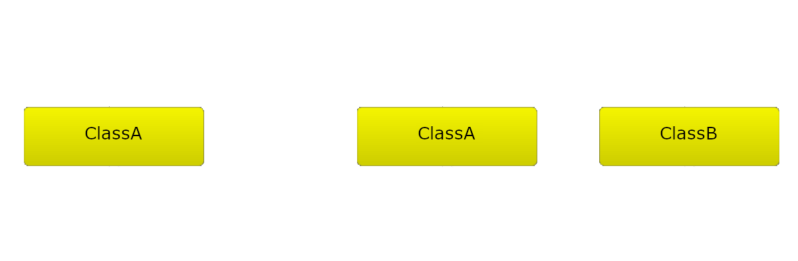

<!-- .slide: data-auto-animate data-background="#111111" -->

## Cykliczne zależności



* <!-- .element: class="fragment fade-in" --> Obiekt klasy A posiada wskaźnik/referencję ustawione na siebie
* <!-- .element: class="fragment fade-in" --> Obiekt klasy A posiada wskaźnik/referencję na obiekt klasy B, który z kolei wskazuje na obiekt klasy A

___
<!-- .slide: data-auto-animate data-background="#111111" -->

## Cykliczne zależności


* <!-- .element: class="fragment fade-in" --> Obiekt klasy A posiada wskaźnik/referencję ustawione na siebie
* <!-- .element: class="fragment fade-in" --> Obiekt klasy A posiada wskaźnik/referencję na obiekt klasy B, który z kolei wskazuje na obiekt klasy A
* <!-- .element: class="fragment fade-in" --> Jak to naprawić?

___

### `std::weak_ptr<>` spieszy z pomocą!

#### Cechy

* <!-- .element: class="fragment fade-in" --> nie jest właścicielem obiektu
* <!-- .element: class="fragment fade-in" --> jedynie obserwuje obiekt
* <!-- .element: class="fragment fade-in" --> przed dostępem do obiektu musi zostać skonwertowany na <code>std::shared_ptr<></code>
* <!-- .element: class="fragment fade-in" --> może zostać utworzony tylko z użyciem <code>std::shared_ptr<></code>

<div>
    
</div>

___

### `std::weak_ptr<>` użycie

<div class="multicolumn" style="position: relative">
<div class="col" style="width: 65%; flex: none">

```cpp
#include <memory>
#include <iostream>

struct Msg { int value; };

void checkMe(const std::weak_ptr<Msg> & wp) {
    std::shared_ptr<Msg> p = wp.lock();
    if (p)
        std::cout << p->value << '\n';
    else
        std::cout << "Expired\n";
}

int main() {
    auto sp = std::shared_ptr<Msg>{new Msg{10}};
    auto wp = std::weak_ptr<Msg>{sp};
    checkMe(wp);
    sp.reset();
    checkMe(wp);
}
```

</div>

<div class="col fragment fade-in">

```bash
> ./a.out
10
Expired
```

</div>
</div>

___

### `std::shared_ptr<>` - cykliczne zależności

* Jak rozwiązać ten problem?

```cpp
#include <memory>

struct Node {
    std::shared_ptr<Node> child;
    std::shared_ptr<Node> parent;
};

int main () {
    auto root = std::shared_ptr<Node>(new Node);
    auto leaf = std::shared_ptr<Node>(new Node);

    root->child = leaf;
    leaf->parent = root;
}
```

___

### Przerywanie cykli - rozwiązanie

* Użyć `std::weak_ptr<Node>` w jednym kierunku

```cpp
#include <memory>
struct Node {
    std::shared_ptr<Node> child;
    std::weak_ptr<Node> parent;
};

int main () {
    auto root = std::shared_ptr<Node>(new Node);
    auto leaf = std::shared_ptr<Node>(new Node);

    root->child = leaf;
    leaf->parent = root;
}
```

```text
==148== All heap blocks were freed -- no leaks are possible
```
<!-- .element: class="fragment fade-in" -->
