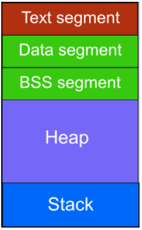

<h2>Memory management problems</h2>
<br/>
<h3>CODERS SCHOOL</h3>
<a href="https://coders.school">https://coders.school</a>

<div class="multicolumn" style="height: 200px; position: relative;">
<div class="col">
    <div style="position: absolute; bottom: 0">
        
    </div>
</div>

<div class="col" style="text-align: right; bottom: 0">
    <div style="position: absolute; bottom: 10px">
        Łukasz Ziobroń
        <a href="mailto:lukasz@coders.school">lukasz@coders.school</a>
    </div>
</div>
</div>
___

<h2>Łukasz Ziobroń</h2>

<div class="multicolumn">
<div class="col" style="font-size: 70%;">

Not only programming experience:

* C++ and Python developer @ Nokia & Credit Suisse
* Scrum Master @ Nokia & Credit Suisse
* Code Reviewer @ Nokia
* Webmaster (HTML, PHP, CSS) @ StarCraft Area

Training experience:

* [C++ trainings @ Coders School](https://coders.school/)
* [Practial Aspects Of Software Engineering](https://zapisy.ii.uni.wroc.pl/offer/praktyczne-aspekty-inzynierii-oprogramowania_151/) @ PWr, UWr
* [Nokia Academy](http://nokiawroclaw.pl/nasze-akcje/akademia/) @ Nokia
* Internal corporate trainings

Public speaking experience:

* [Academic Championships in Team Programming](http://amppz.ii.uni.wroc.pl/amppz2016/)
* [code::dive conference](https://codedive.pl/)
* code::dive community

</div>

<div class="col">
    
</div>


___

## Agenda

* <!-- .element: class="fragment fade-in" --> Process memory allocation
  * <!-- .element: class="fragment fade-in" --> process memory map
  * <!-- .element: class="fragment fade-in" --> stack vs heap
  * <!-- .element: class="fragment fade-in" --> stack allocation
  * <!-- .element: class="fragment fade-in" --> heap allocation
  * <!-- .element: class="fragment fade-in" --> new expression and operator <code>new</code>
  * <!-- .element: class="fragment fade-in" --> dynamic array allocation
  * <!-- .element: class="fragment fade-in" --> dynamic allocation problems
* <!-- .element: class="fragment fade-in" --> RAII
* <!-- .element: class="fragment fade-in" --> Memory corruption detection

___

## Process memory map

* text - the machine instructions
* data - initialized static and global data
* bss - uninitialized static data
* heap - dynamically allocated memory
* stack - the call stack, which holds return addresses, local variables, temporary data



___

## Stack vs Heap

* <!-- .element: class="fragment fade-in" --> Stack
  * <!-- .element: class="fragment fade-in" --> very fast access
  * <!-- .element: class="fragment fade-in" --> limit on stack size (OS-dependent)
  * <!-- .element: class="fragment fade-in" --> not fragmented memory
  * <!-- .element: class="fragment fade-in" --> automatic memory management (by CPU via Stack Pointer – SP)

* <!-- .element: class="fragment fade-in" --> Heap
  * <!-- .element: class="fragment fade-in" --> slower access
  * <!-- .element: class="fragment fade-in" --> no limit on memory size (OS-managed)
  * <!-- .element: class="fragment fade-in" --> memory may become fragmented
  * <!-- .element: class="fragment fade-in" --> manual memory management (allocation and deallocation)

___

## Stack allocation

<div class="multicolumn">
<div class="col">

* A call stack is composed of stack frames

* A stack frame usually includes at least:
  * arguments passed to a function (if any)
  * the return address back to the caller
  * space for local variables (if any)
* Automatic deallocation when out of scope


</div>
<div class="col">

```cpp
#include <iostream>

int sum(int a, int b)
{
    return a + b;
}

int main()
{
    int a = 10;
    int b = 20;

    std::cout << sum(a, b);

    return 0;
}


```

</div>
</div>

___

## Stack overflow

* There is a limit on a stack size (OS dependent)

```cpp
int foo()
{
    double x[1048576];
    x[0] = 10;
    return 0;
}

int main()
{
    foo();
    return 0;
}
```

___

## Heap allocation

<div class="multicolumn">
<div class="col" style="margin-top: 70px; font-size: 85%;">

Heap allocation consists of a few steps:

* <!-- .element: class="fragment fade-in" --> pointer allocation on a stack
* <!-- .element: class="fragment fade-in" --> `sizeof(T)` bytes allocation on a heap
* <!-- .element: class="fragment fade-in" --> `T`’s constructor call on allocated memory
* <!-- .element: class="fragment fade-in" --> the memory address assignment to the pointer
* <!-- .element: class="fragment fade-in" --> manual deallocation using `delete` operator

</div>
<div class="col" style="margin: 15px;">

```cpp
void heap()
{
    int *p = new int(100);
    delete p;
}

void heap()
{
    int *p;
    p = new int;
    *p = 100;
    delete p;
}
```

</div>
</div>

___

## New expression and operator `new`

[new expression](https://en.cppreference.com/w/cpp/language/new) does 3 things:

* `sizeof(T)` bytes allocation on a heap (via proper [operator `new`](https://en.cppreference.com/w/cpp/memory/new/operator_new))
* `T`’s constructor call on allocated memory
* the memory address assignment to the pointer

```cpp
// replaceable allocation functions
void* operator new ( std::size_t count );
void* operator new[]( std::size_t count );
// replaceable non-throwing allocation functions
void* operator new ( std::size_t count, const std::nothrow_t& tag);
void* operator new[]( std::size_t count, const std::nothrow_t& tag);
// user-defined placement allocation functions
void* operator new ( std::size_t count, user-defined-args... );
void* operator new[]( std::size_t count, user-defined-args... );
// additional param std::align_val_t since C++17, [[nodiscard]] since C++20
// some more versions on https://en.cppreference.com/w/cpp/memory/new/operator_new
```

___

## Dynamic array allocation

* `delete[]` is used to free an array memory

```cpp
#include <iostream>

int main() {
    int staticArray[] = {1, 2, 3, 4, 5, 6};

    constexpr auto size = 10;
    int* dynamicArray = new int[size];
    for (int i = 0; i < size; ++i)
        *(dynamicArray + i) = i * 10;

    for (int i = 0; i < size; ++i)
        std::cout << dynamicArray[i] << '\n';

    delete[] dynamicArray;
}
```

___

## Dynamic allocation problems

* accessing out-of-bounds memory
* dangling pointer
* double deleting
* `null` pointer dereference
* freeing memory blocks that were not dynamically allocated
* freeing a portion of a dynamic block
* memory leak

These problems can be addressed by ASAN (Address Sanitizer) or Valgrind.
Unfortunately they do not work on Windows 😕

___

## Accessing out-of-bounds memory

Undefined behavior

```cpp
#include <iostream>

int main() {
    const auto size = 10;
    int* dynamicArray = new int[size];

    for (int i = 0; i <= size; ++i)
        *(dynamicArray + i) = i * 10;

    for (int i = 0; i <= size; ++i)
        std::cout << dynamicArray[i] << '\n';

    delete[] dynamicArray;
}
```

___

## Dangling pointer

Pointer which indicate to something that is not valid

```cpp
#include <iostream>

struct Msg {
    int value{100};
};

void processMsg(Msg* msg) {
    std::cout << msg->value << '\n';
}

int main() {
    Msg* m = new Msg();
    // ...
    delete m;
    processMsg(m);

    return 0;
}
```

___

## Double delete

Happens when a dangling pointer is deleted

```cpp
class Msg {};

void processMsg(Msg* msg) {
    // ...
    delete msg;
}

int main() {
    Msg* m = new Msg{};
    processMsg(m);
    delete m;
}
```

___

## Null pointer dereference

Happens when a `nullptr` is used

```cpp
#include <iostream>

int main() {
    int* p = new int{10};
    delete p;
    p = nullptr;

    std::cout << *p << '\n';

    return 0;
}
```

___

## Freeing stack allocated blocks

```cpp
class Msg {};

void processMsg(Msg* msg) {
    // ...
    delete msg;
}

int main() {
    Msg m;
    processMsg(&m);

    return 0;
}
```

___

## Freeing a portion of a dynamic block

Using `delete` instead of `delete[]`

```cpp
int main() {
    constexpr auto size = 4u;
    int* array = new int[size]{1, 2, 3, 4};
    delete array;

    return 0;
}
```

___

## Memory leak

Allocated memory which cannot be freed because there is no pointer that points to it

```cpp
#include <iostream>

int main() {
    int* p = new int{10};
    p = new int{20};
    std::cout << *p << '\n';
    delete p;

    return 0;
}
```

___

## A simple question…

How many possible paths of execution are here?

```cpp
String EvaluateSalaryAndReturnName(Employee e)
{
    if( e.Title() == "CEO" || e.Salary() > 100000 )
    {
        cout << e.First() << " " << e.Last()
             << " is overpaid" << endl;
    }
    return e.First() + " " + e.Last();
}

```

* 23 (twenty three)
* Exceptions are the reason
* Example by Herb Sutter, [GotW#20](http://www.gotw.ca/gotw/020.htm)

___

## RAII

<div class="multicolumn">
<div class="col">

* <!-- .element: class="fragment fade-in" --> Resource Acquisition Is Initialization
  * <!-- .element: class="fragment fade-in" --> idiom / pattern in C++
  * <!-- .element: class="fragment fade-in" --> each resource has a handler
  * <!-- .element: class="fragment fade-in" --> acquired in constructor
  * <!-- .element: class="fragment fade-in" --> released in destructor
* <!-- .element: class="fragment fade-in" --> Benefits
  * <!-- .element: class="fragment fade-in" --> shorter code (automation)
  * <!-- .element: class="fragment fade-in" --> clear responsibility
  * <!-- .element: class="fragment fade-in" --> applies to any resources
  * <!-- .element: class="fragment fade-in" --> no need for <code>finally</code> sections
  * <!-- .element: class="fragment fade-in" --> predictable release times
  * <!-- .element: class="fragment fade-in" --> language-level guarantee of correctness

</div>
<div class="col" style="font-size: 70%;margin-top: 70px;">

|             | Acquire       | Release          |
|:-----------:|:-------------:|:----------------:|
| memory      | new, new[]    | delete, delete[] |
| files       | fopen         | fclose           |
| locks       | lock, try_lock| unlock           |
| sockets     | socket        | close            |

</div>
___

## Memory corruption detection

* Address Sanitizer (ASAN)
  * add compilation flags –fsanitize=address -g
  * run a binary
* Valgrind
  * compile a binary
  * run a binary under valgrind:
  * valgrind /path/to/binary
  * use additional checks:
  * valgrind --leak-check=full /path/to/binary

Neither work on Windows 😕

<!-- Changed "Both does not work on windows 😕" into
             "Neither work on windows 😕 -->

___

<h3>CODERS SCHOOL</h3>
<a href="https://coders.school">https://coders.school</a>

<br/><br/>

<div class="multicolumn" style="height: 200px; position: relative;">
<div class="col">
    <div style="position: absolute; bottom: 0">
        
    </div>
</div>

<div class="col" style="text-align: right; bottom: 0">
    <div style="position: absolute; bottom: 10px">
        Łukasz Ziobroń
        <a href="mailto:lukasz@coders.school">lukasz@coders.school</a>
    </div>
</div>
</div>
